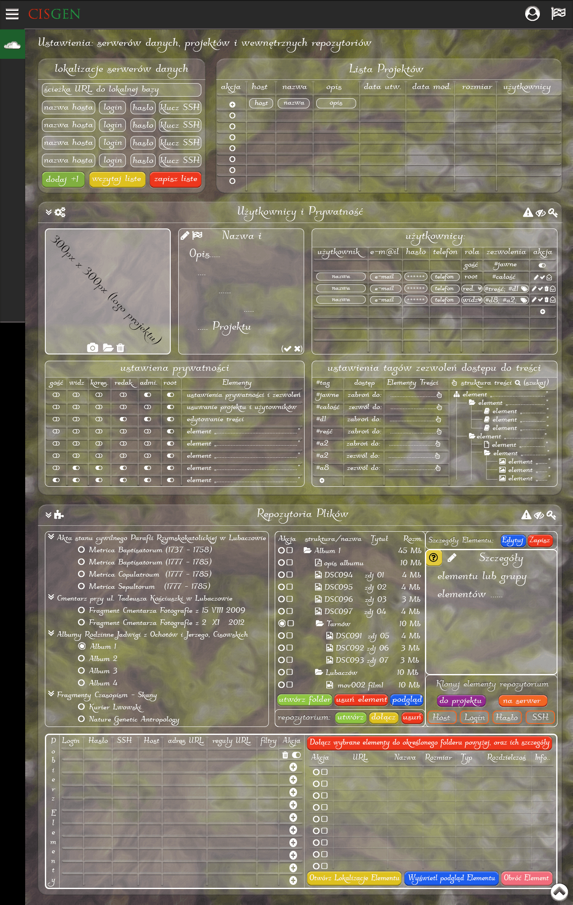

(opis projektu)

# (wstępna) IDEA projektu CISGEN : Layout i Działanie

## 1.0 Ustawienia Podstawowe: Serwery, Projekty, Użytkownicy, Repozytoria


### 1.1 Lokalizacje serwerów danych
Serwer Danych - jest to miejsce przechowywania bazy danych, docelowo baza powinna się mieścić w chmurze aby zapewnić dostęp każdemu uprawnionemu z dowolnego miejsca, dodatkowo można też posiadać lokalną kopię, na dysku, w 1 bazie danych może znajdować się wiele projektów.

### 1.2 Lista Projektów
Lista Projektów - Wyświetla listę projektów znajdujących się w podanych lokalizacjach, klawisz `+` pozwala utworzyć nowy projekt, należy w oknie hosta wybrać dostępną bazę (z zbioru wskazanych serwerów) oraz podać jej nazwę i opis, nazwę i opis można później edytować w panelu Użytkownicy i Prywatność.


### 1.3 Użytkownicy i Prywatność
Użytkownicy i Prywatność -  w tej sekcji możemy ustawić szczegóły projektu, takie jak: logo; wielojęzyczną nazwę, wielojęzyczny opis, oraz dodać użytkowników projektu i przyznać im dostęp do treści i ustawień. Wskazanym jest dodadnie logo projektu.

#### 1.3.1 Nazwa i Opis(edycja)

```JSON
{ "pl": { "nazwa": "Twoja_Nazwa", "opis": "Twój_Opis" }, 
  "en": { "nazwa": "Your_Name", "opis": "Your_Description" } }
```

#### 1.3.2 Użytkownicy
Każdy nowo utworzony projekt posiada 2 sztywno utworzonych urzytkowników:
- rola: **root**; zezwolenia: **#całość**;
- rola: **gość**; zezwolenia: **#jawne**;
na wstępie powinno się podać rootowi, nazwę, e-mail, hasło, i telefon; dodatkowa można także (niezalecane) wyłączyć gościa; koperta w polu akcji, wysyła na podanego email-a, dane logowania do projektu, istnieje także możliwość dodania dodatkowych użytkowników.

#### 1.3.3 ustawienia prywatności i zezwoleń
Niemalże każdy kto kiedykolwiek kożystał z internetowych mechanizmó do budowy drzewa np. MyHeritage, pluł sobie w brodę, rozważając 4 opcje

- prywatne drzewo z możliwością edycji przez każdego z użytkownika **(minusy: nikt bez zalogowania nic nie widzi; inny użytkownik może niechcący usunąc istotne informacje, lub dodać już istniejące po raz kolejny)**
- prywatne drzewo z możliwością edycji przez administratora **(minusy: nikt bez zalogowania nic nie widzi; mniejsze zainteresowanie drzewem z powodu braku możliwości wpływania na treść)**
- publiczne drzewo z możliwością edycji przez każdego z użytkownika **(minusy: każdy może zobaczyć wszytkie zdjęcia i informacje o wszystkich osobach zmarłych; inny użytkownik może niechcący usunąc istotne informacje, lub dodać już istniejące po raz kolejny)**
- publiczne drzewo z możliwością edycji przez administratora **(minusy: każdy może zobaczyć wszytkie zdjęcia i informacje o wszystkich osobach zmarłych; mniejsze zainteresowanie drzewem z powodu braku możliwości wpływania na treść)**

Żadna z powyższych opcji mi nie odpowiada, prponuję zupełnie inny model:

##### 1.3.4 Role:
- **root** z dostępem do ustawień projektu: dodawania użytkowników, i innych ustawień
- **administrtor** dostęp do ustawień zezwoleń, i edycji treści
- **redaktor** osoba z dostępem do edycji treści; oraz mająca dostęp do wybranych nie publicznych treści.
- **korespondent** osoba mogąca pozornie edytowoć treść, poprzez dodawanie treści i zgłaszanie korekt, które musi zatwierdzić administrator; oraz mająca dostęp do wybranych nie publicznych treści.
- **widz** osoba mająca dostęp do wybranych nie publicznych treści.
- **gość** osoba nie zalogowana z dostępem tylko do jawnych treści.
na wstępie powinno się podać rootowi, nazwę, e-mail, hasło, i telefon; dodatkowa można także (niezalecane) wyłączyć gościa; koperta w polu akcji, wysyła na podanego email-a, dane logowania do projektu, istnieje także możliwość dodania dodatkowych użytkowników.

##### 1.3.5 Zezwolenia:
Dodatkowo każdy z użytkowniów oprócz Roota i Gościa, może zawierać dowolną ilość tagów zezwoleń (atoryzacji) dodtępu do wybranych treści, dzięki temu mogę szczegółuwo kontrolować kto do jakich części ma dostęp, tagi prywatności, można dodawać bezpośrednio z poziomu edycji treści, lub z poziomu ustawień, tworząc nowy tag, i przypisywując do niego (za pomocą przeciągnięcia elementy) oraz określając funkcje **zezwól dostęp do** lub **zabroń dostępu do**.


### 1.4 Repozytoria Plików
Treść choćby była najlepiej opracowana i zredagowana, zawsze pozostanie suchą treścią, chcąc ją ubogacić niezbędne są skany źródłowych dokumentów historycznych, grafiki, zdjęcia, etc., wszystkie te elementy zajmują dużo miejsca, z drugiej jednak strony warto posiadać kopię (bezpieczeństwa), rozmaitych dokumentów. Stąd mój model plików zewnetrznych - model plików zewnęrznych (repozytoriów):

#### 1.4.1 Utworzenie Repozytorium
polega na utworzeniu wewnątrz bazy dnych w katalogu repozytoiów folderu o losowym niepowtarzalnym ID a w nim pliku **`CISGEN-REPOZYTORIUM.JSON`** po utworzeniu pustego pliku możemy edytować jego szczegóły, aby repozytorium prawidłowo było kategoryzowane w spisie repozytoriów; Oto Przykład:

> ```JSON
> {
>     "repozytorium": {
>         "id": 002345013042,
>         "prawa": "CC-BY-SA-ND",
>         "nazwa": [{
>             "jezk": "pl",
>             "nazwa": "Twoja Nazwa"
>         }, {
>             "jezk": "en",
>             "nazwa": "Your Name"
>         }],
>         "tagi": [{
>             "id": 03456730243,
>         }, {
>             "nazwa": [{
>                 "jezk": "pl",
>                 "nazwa": "nazwa grupy 1"
>             }, {
>                 "jezk": "en",
>                 "nazwa": "name group 1"
>             }]
>         }, {
>             "id": 03454730243,
>         }, {
>             "nazwa": [{
>                 "jezk": "pl",
>                 "nazwa": "nazwa grupy 2"
>             }, {
>                 "jezk": "en",
>                 "nazwa": "name group 2"
>             }]
>         }]
>     },
>     "elementy": [{ }]
> }
```


#### 1.4.2 Dodawanie elementów do Repozytorium
...i tu sprawa się troszkę, pozornie komplikuje, ale to tylko dlatego by docelowo usprawnić dodawanie tylko i wyłącznie chcianych elementów, ktoś powie przecież możesz zaznaczyć te które chcesz dodać.. tak 5, 10, 15, tak, ale nie jak dodajemy 1000 elementów z zbioru posiadającego 5000 pozycji :/ 

##### 1.4.2.1 Utworzenie tymczasowej tablicy elementów z sprepraowanych lokalizacji źródłowych.

 W pierwszej kolejności należy określić jakie elemnty i skąd mają być pobierane. Można podać np.
 
 - lokalny adres folderu np. `C:\User\Obrazy\Folder1\`
 - lub adres konkretnego pliku np. `http://agadd2.home.net.pl/metrykalia/
301/sygn.%201108/images/PL_1_301_1108_0259.jpg` 

 - podając lokalizacje folderu można dodatkowo ustawić filty np.: `typ:jpg` lub `rozmiar x < : 500 kb`, 
 - jeśli np. chcemy dodać pliki online nie znajdujące się w folderze np zbiór kolejnych plików od `http://agadd2.home.net.pl/metrykalia/
301/sygn.%201108/images/PL_1_301_1108_0001.jpg` do `http://agadd2.home.net.pl/metrykalia/
301/sygn.%201108/images/PL_1_301_1108_0259.jpg` można podać regułę URL , np.:
> ```JSON
> const a = 'http://agadd2.home.net.pl/metrykalia/
301/sygn.%201108/images/PL_1_301_1108_';
> const c = '.jpg';
>  
>   
>  
>   
> ```


##### 1.4.2.2 Dołączanie wybranych elementów z tymczasowej tablicy do odpowiednich podfolderów repozytorium.
(opis)

##### 1.4.2.3 Edycja Szczegółów Elementów (masowa i detalaiczna)
(opis)

#### 1.4.3 Klonowanie Elementów Repozytorium: do lokalnej ścieżki i na serwer
(opis)

#### 1.4.4 Dołanczanie już istniejących Repozytoriów.
(opis)